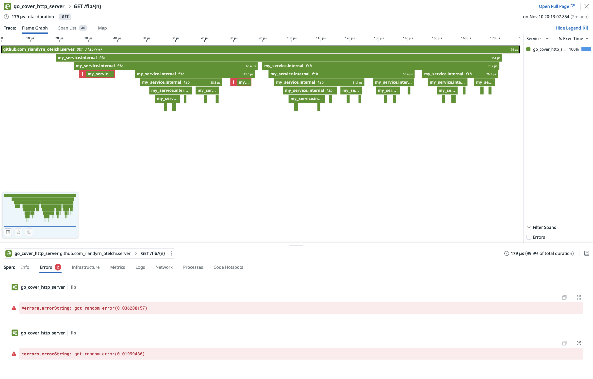
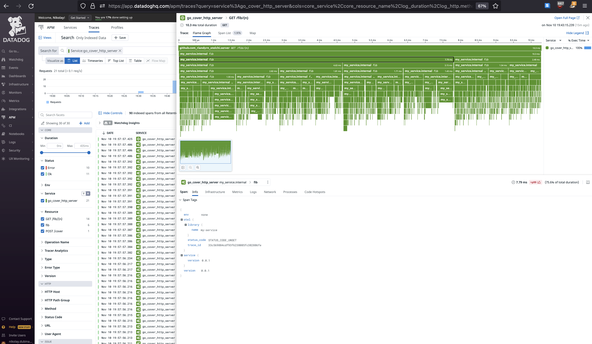
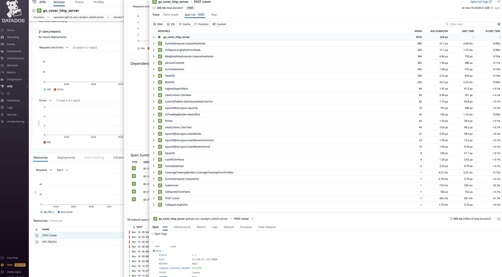

# ⚡️ go-instrument

[](https://codecov.io/gh/nikolaydubina/go-instrument)
[](https://goreportcard.com/report/github.com/nikolaydubina/go-instrument)
[](https://pkg.go.dev/github.com/nikolaydubina/go-instrument)
[](https://github.com/avelino/awesome-go#performance)
[](https://github.com/nikolaydubina/go-recipes)
[](https://securityscorecards.dev/viewer/?uri=github.com/nikolaydubina/go-instrument)
[](https://hits.sh/github.com/nikolaydubina/go-instrument/)

Automatically add Trace Spans to Go methods and functions.

```bash
go install github.com/nikolaydubina/go-instrument@latest
```

```bash
find . -name "*.go" | xargs -I{} go-instrument -app my-service -w -filename {}
```

Functions and methods with `ctx context.Context` in arguments
```go
func (s Cat) Name(ctx context.Context) (name string, err error) {
  ...
```

will be instrumented with span
```go
func (s Cat) Name(ctx context.Context) (name string, err error) {
	ctx, span := otel.Trace("my-service").Start(ctx, "Cat.Name")
	defer span.End()
	defer func() {
		if err != nil {
			span.SetStatus(codes.Error, "error")
			span.RecordError(err)
		}
	}()
  ...
```

Example HTTP server [go-instrument-example](https://github.com/nikolaydubina/go-instrument-example) as it appears in Datadog.


This tool uses standard Go library to modify AST with instrumentation.
You can add new instrumentations by defining your own `Instrumenter` and invoking `Processor` like it is done in `main`.

## Features

- [x] no dependencies
- [x] 500 LOC
- [x] OpenTelemetry
- [x] functions that have named error return will get spans with span status set to error
- [x] keeps comments
- [x] Go compiler directives[^1]
- [x] dynamic error variable name
- [ ] dynamic ctx variable name
- [ ] creating error when return is not named
- [x] detection if function is already instrumented
- [ ] span Tags arguments
- [ ] span Tags returns
- [ ] changing `_` to `ctx` when it is unused
- [ ] mode to remove added instrumentation

## Motivation

It is laborious to add tracing code to every function manually.
The code repeats 99% of time.
Other languages can either modify code or have wrapper notations that makes even manual tracing much less laborious.

As of `2025-05-11`, official Go does not support automatic function traces[^2].
> Is there a way to automatically intercept each function call and create traces?  
>   
> Go doesn’t provide a way to automatically intercept every function call and create trace spans. You need to manually instrument your code to create, end, and annotate spans.

Thus, providing automated version to add Trace Spans annotation.

## Performance 

### Go Compiler Inlining

Since we are adding multiple functions calls, it affects Go compiler decisions on inlining.
It is expected that Go will less likely inline.

For example, can inline function
```bash
$ go build -gcflags="-m -m" ./internal/testdata 2>&1 | grep OneLine
internal/testdata/basic.go:80:6: can inline OneLineTypical with cost 62 as: func(context.Context, int) (int, error) { return fib(n), nil }
```

```bash
go-instrument -w -filename internal/testdata/basic.go
```

Can not inline after instrumentation
```bash
$ go build -gcflags="-m -m" ./internal/testdata 2>&1 | grep OneLine
internal/testdata/basic.go:132:6: cannot inline OneLineTypical: unhandled op DEFER
``` 

## Appendix A: Related Work

* https://github.com/hedhyw/otelinji — Very similar to current project. This tool gracefully handles code comments, so that its output can be tracked with normal code in version control. Main difference current project focuses on minimal code and dependencies.
* https://github.com/open-telemetry/opentelemetry-go-instrumentation — (in development) official eBPF based Go auto instrumentation
* https://github.com/keyval-dev/opentelemetry-go-instrumentation — eBPF based Go auto instrumentation of _pre-selected_ libraries
* https://developers.mattermost.com/blog/instrumenting-go-code-via-ast — Very similar. Instrumenting Go code for tracing.
* https://github.com/gobwas/gtrace — non-OTEL, custom tracing framework that uses code generation

## Appendix B: Other Languages

### Java

Java runtime modifies bytecode of methods on load time that adds instrumentation calls.
Pre-defined libraries are instrumented (http, mysql, etc).

✅ Very short single line decorator statement can be used to trace selected methods.

Datadog
```java
import datadog.trace.api.Trace

public class BackupLedger {
  @Trace
  public void write(List<Transaction> transactions) {
    for (Transaction transaction : transactions) {
      ledger.put(transaction.getId(), transaction);
    }
  }
}
```

OpenTelemetry
```java
import io.opentelemetry.instrumentation.annotations.WithSpan;

public class MyClass {
  @WithSpan
  public void myMethod() {
      <...>
  }
}
```

✅ Automatic instrumentation of all functions is also possible.

Datadog supports wildcard for list of methods to trace.

> dd.trace.methods  
> Environment Variable: DD_TRACE_METHODS  
> Default: null  
> Example: package.ClassName[method1,method2,...];AnonymousClass$1[call];package.ClassName[*]  
> List of class/interface and methods to trace. Similar to adding @Trace, but without changing code. Note: The wildcard method support ([*]) does not accommodate constructors, getters, setters, synthetic, toString, equals, hashcode, or finalizer method calls

```bash
java -javaagent:/path/to/dd-java-agent.jar -Ddd.service=web-app -Ddd.env=dev -Ddd.trace.methods="*" -jar path/to/application.jar
```

* [Java Auto-Instrumentation](https://docs.oracle.com/javase/8/docs/api/java/lang/instrument/package-summary.html)
* [Datadog Java Auto-Instrumentation](https://docs.datadoghq.com/tracing/trace_collection/dd_libraries/java/?tab=containers#automatic-instrumentation)
* [Datadog Java Tracing Config](https://docs.datadoghq.com/tracing/trace_collection/library_config/java/#ddtracemethods)
* [Datadog Instrumentation Business Logic](https://docs.datadoghq.com/tracing/guide/instrument_custom_method/?code-lang=java)
* [Javaassist](https://www.javassist.org)

### Python

Python monkeypatching of functions at runtime is used to add instrumentation calls.
Pre-defined libraries are instrumented (http, mysql, etc).

✅ Very short single line decorator statement can be used to trace selected methods.

Datadog
```python
from ddtrace import tracer

class BackupLedger:
    @tracer.wrap()
    def write(self, transactions):
        for transaction in transactions:
            self.ledger[transaction.id] = transaction
```

OpenTelemetry
```python
@tracer.start_as_current_span("do_work")
def do_work():
    print("doing some work...")
```

⚠️ Automatic instrumentation of all functions is also possible via monkeypatching (fidning stable library is pending).

* [OpenTelemetry Python Instrumentation](https://opentelemetry.io/docs/instrumentation/python/automatic/#overview)
* [Blog: Timescale: OpenTelemetry and Python: A Complete Instrumentation Guide](https://www.timescale.com/blog/opentelemetry-and-python-a-complete-instrumentation-guide/)
* https://github.com/harshitandro/Python-Instrumentation

### C++

❌ Only manual instrumentation.

### Rust

✅ Very short single line decorator statement can be used to trace selected functions with well-establisehd tokio framework.

```rust
#[tracing::instrument]
pub fn shave(yak: usize) -> Result<(), Box<dyn Error + 'static>> {
```

```rust
#[instrument]
async fn write(stream: &mut TcpStream) -> io::Result<usize> {
```

* https://github.com/tokio-rs/tracing
* https://opentelemetry.io/docs/instrumentation/rust
* https://docs.rs/opentelemetry/latest/opentelemetry
* https://github.com/open-telemetry/opentelemetry-rust/tree/main/examples
* https://docs.rs/datadog-apm/latest/datadog_apm

## Appendix C: Generating Many Spans

`1.97K` spans, fibbonaci



`3.7K` spans, go cover treemap



## ADR

- `2025-05-11` not using commands like `//instrument:exclude` because: in practice this tool is used to instrument everything; there is still mechanism to exclude whole file; there is already automatic detection of instrumented functions. therefore, to simplify not using commands.
- not using eBPF because: with eBPF we can track latency, but we would not be able to assign errors to spans; some platforms may not have access to eBPF;
- not wrapping internal functions. benefit of wrapping is to keep original code without modifications. however, manual step for switching would still be requied. given every single function is duplciated and is within same package, code will quickly become messy and hard to maintain by user.
- not wrapping exported functions. typically, packages are failry big and performs lots of logic. oftencase, business domains are split only in few large packages. low level packages are already likely to be traced with standard tracing (MySQL, `het/http`, etc). thus, it is doubtful how much benefit would be from tracing only exported functions and only on import
- not wrapping exported functions with separate package, because this would lead to circular dependency failure, since some even exported functions in original package may be called withing same package. thus, we would either skip those calls, or fail with circular dependency while trying to wrap those.

[^1]: https://pkg.go.dev/cmd/go#hdr-Build_constraints
[^2]: https://go.dev/doc/diagnostics
